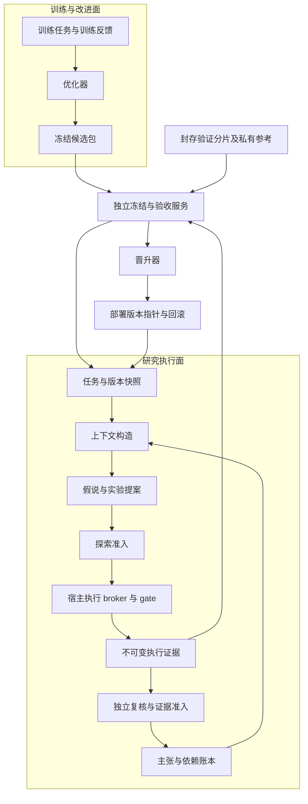

# 可逐模块证伪的研究架构

日期：2026-09-12。状态：待实施设计；本文件没有宣告模块上线或实验通过。

依据：[用户分享的研究架构对话](https://chatgpt.com/s/t_6aa5249396488191a62ee99332081c77)、本轮代码核查，以及[既有外部 benchmark 报告](../../research-loop-benchmark-20260912/REPORT.md)。用户已明确：**所有优化只能访问训练集；验证集只验收。** 具体数据协议见 [MODULAR-EXPERIMENT-PROTOCOL.md](MODULAR-EXPERIMENT-PROTOCOL.md)。本设计新增研究路线，不改写既有冻结 SPEC、历史结果或生产暂停状态。

## 1. 行为、验证、不变量与交付

目标行为：所有模块保持明确输入、输出与权限，可在独立工作树并行实现；在两个既有外部 benchmark 上分别检验单独、条件与组合效果。通过独立验收的是精确冻结版本或组合包；单模块无增益不排除组合价值。具体见 [并行实现与组合实验](PARALLEL-IMPLEMENTATION-AND-COMBINATION-TESTS.md)。

验证分三层：接口和失败路径测试证明工程接线；受控扰动解释模块是否按预期工作；DiscoveryBench 与 BLADE 的未用于优化的任务检验迁移效果。三层不能互相代替。

不变量：原始证据与解释分离；摘要不增加证据权重；执行成功不等于科学有效；有效阴性不等于测量无效；探索许可不等于证据准入；优化器不能读验证数据、改变评价器或自行晋升；所有运行仍受宿主权限、资源和工具契约约束。

本轮交付为架构、模块/组合实验路线和数据隔离协议。先冻结 P0 接口，再并行实现独立模块并逐个检验；随后对所有合格候选做组合交互与整体验收。每个模块仍有独立工件和两 benchmark 记录，不以一次总分取代逐项检验。

**完整范围约束：原对话的八个问题全部保留，不按实现方便程度删减。** [逐问题实验覆盖表](MODULAR-RESEARCH-COVERAGE.md) 是范围验收依据：每一项都必须有实现、机制实验和两 benchmark 检验记录。先后顺序不表示重要性；模块效果不佳可以不进入默认运行包，但不能据此取消其问题、实验或后续复核。数据不足时保留该项为待独立验收，不能缩减范围后宣告全部完成。

## 2. 从对话问题到可验证机制

| 问题 | 设计机制 | 必须辨别的替代解释 |
| --- | --- | --- |
| 历史叙事让错误前提反复进入上下文 | M2 证据/主张账本，M3 按最新证据状态构造上下文 | 只是减少了上下文长度；或过度撤回了正确主张 |
| 成功压力、反向迎合、假完成 | M1 类型与状态边界，M5 独立证据复核 | 只是更保守、总说不支持，或评分器误读否定句 |
| 假说多但机制同质，实验无法区分 | M4 竞争预测与最小区分实验 | 只是多调用模型或换了术语 |
| 反方跟随先发解释，审计彼此相关 | M5 先独立提交再比较，允许没有实质反例 | 改善来自额外计算或不同底座模型 |
| 想法能运行但无法回答问题 | M4 区分预测，M7 可行性分阶段兑现 | 代码退出成功被误记为科学正确 |
| 检索只增强确认偏误 | M6 支持、反证、方法资源三路检索 | 更多文本、来源转述重复计权、检索到 benchmark 答案 |
| 严格门槛把探索空间封死 | M1 分开探索/证据状态，M7 受限探索预算 | 放宽了证据门或产生大量无价值试验 |
| 并行实验相互污染，先完成者影响其他臂 | M8 原子 FIFO 领取、快照与归并屏障 | 吞吐提升只是多用了资源；速度改变了结论 |
| 自我修改加速评分错误闭环 | M9 训练限定元改进，独立冻结验收 | 记住训练题、反复试验证集或改了量尺 |

对话中的 W012/W014、布尔字符串、审计缺项等是历史诊断线索，不据此宣称当前每个入口仍有这些缺陷。复用前逐入口重现；已修好的能力保持，补缺失接线。撤回无效旧主张不要求先有更优替代理论；接纳新主张则必须另有证据。

## 3. 三个权限面与仓库归属



图中 L→CT 只限同一训练域，或验证任务自己的临时状态。验证结果、证据、摘要与日志没有通向优化器的返回通道。

| 所有者 | 职责 | 明确边界 |
| --- | --- | --- |
| `research-loop` | 研究对象、上下文、假说、复核、探索、任务控制、候选版本 | 不复制工具级科学前置条件；不调用正在评价自己的评分器改规则 |
| `research-loop` 中独立 `evaluation/` 运行包 | 数据托管、切分、评价器、封存回执、验收账本 | 与被测包分别构建、分别挂载、分别授权；独立目录/进程本身不构成隔离 |
| `ai4s-gate` | 有界 skill 检索、契约检查、subject/artifact 绑定、已验证 prerequisite | 不判科研方向价值，不拥有 benchmark 标签，不成为研究调度器 |
| 宿主 adapter / execution broker | 实际工具调用、资源上限、进程/容器、可信验证器与部署确认 | `easy-agent`、Pi 等可替换；核心研究对象不导入宿主 SDK |
| `policy-signature` | 独立 G1–G4 研究 | 本架构不修改其实验、资源、调度或私有题目 |

先用同进程纯接口加两个独立运行包，不引入图数据库、消息集群或多服务部署。SQLite 与内容寻址文件足够承载首期对象；权限隔离放在运行包和执行环境。

## 4. 当前能力与复用位置

2026-09-12 只读核查：`research-loop` 主检出 `dfaebe5`，`ai4s-gate` 为 `0be7dd6`。

| 能力 | 当前证据 | 新设计中的处理 |
| --- | --- | --- |
| FIFO、Task/Rule/Evidence、版本/冻结 trial、评分子进程、晋升/回滚 | `research_loop/agent.py`、`store.py`、`evaluate.py`、[SELF_IMPROVING.md](SELF_IMPROVING.md) | 复用状态与内容校验；增加训练/验证域、暴露记录和阶段验收 |
| 提案/执行证据复核的修复版本 | 既有 benchmark 引用隔离工作树 `92ffe13`；不等同于主检出 | 明确选版本及函数来源，经接口迁移和集成验证；不混用主仓与隔离包 |
| 外部 benchmark 执行与匿名适配评分 | `../../research-loop-benchmark-20260912/discovery/run_discovery.py`、`scienceagent/run_blade_v2.py` | 提取两个 adapter 与共同 broker；保留旧 runner、协议和结果 |
| Pi 路由、tool_call 拦截、tool_result 验证回调、经验写入 | `../../ai4s-gate/src/adapters/pi/index.ts` | 作为可选执行 adapter，逐 seam 验证；默认零退出仍不产生科学晋升 |
| gate 的 shadow、events、modelPolicy | [VERIFIED-STATUS.md](../../ai4s-gate/docs/VERIFIED-STATUS.md) 明确仍需宿主接线 | 复用 helper；不能把 store active 记作真实部署成功 |
| gate `evaluateOnHeldOut` | 对同进程 route events 作头尾划分与重放 | 仅路由工程检查，不作为本设计的分组切分、数据权限或科学验收服务 |

现有运行包要求执行者和两审计者 provider identity 不同，而旧外部实验是明确标注的同模型协议配置。新实验保留这个区别：使用独立 benchmark harness 做同底座机制对照；不得伪造 identity 绕过生产运行包。不同名字或两次同模型调用都不能证明统计独立。

新建独立版本的 `evaluation/modular`，不把旧 `evaluate.py` 的 task→status 标签与计数 receipt 直接升级为两 benchmark 的科学量尺。旧 `Task.family` 不是经过审计的来源独立组；迁移须提供明确的 group provenance 和 schema 版本。可复用的是冻结/封存/显式晋升模式，不是默认统计有效性。

## 5. 对象模型：状态分开，来源贯通

所有对象共有 `schema_version/id/content_hash/scope/source_run_id/snapshot_id`；涉及数据的对象还带 `dataset_version/group_id/split_id/data_domain`。跨任务复用必须先检查域、来源与依赖；仅有自报 hash 不证明来源可信。

| 对象 | 最小专有字段 | 约束 |
| --- | --- | --- |
| `EvidenceRecord` | artifact hashes、操作、观测、独立来源组、验证状态、subject binding | 不可变；同一观测的日志/报告/摘要共用根 evidence id；独立重复实验另建 id |
| `ClaimRecord` | 命题、范围、支持关系、反对关系、状态与修订事件 | 原始证据不随主张撤回而删除；只复核受影响的支持链 |
| `HypothesisBranch` | 机制、假设、干预、可区分预测、淘汰条件、分支状态 | 未被证伪不自动受支持；只换表述不增加机制多样性 |
| `ContextBundle` | 对象引用、状态版本、反证、待复核项、预算、构造器版本 | 是派生缓存，不是 Evidence；依赖失效后旧 bundle 不能重新成为事实 |
| `ExperimentPlan` | question、hypothesis ids、主要终点、对照、分析规则、预算、停止条件 | 看到结果后只能终止/新开版本；不能覆盖冻结计划 |
| `ReviewRecord` | evidence refs、支持/反例、需修复项、判断、不确定性 | 内部 reviewer 不担任 benchmark outcome scorer |
| `ModulePackage` | module id/version、父版本、配置/代码/提示/记忆/检索快照 hashes | 单模块阶段只变一个模块；组合阶段使用预注册activation vector与BundleManifest；禁止验证域来源 |
| `EvaluationReceipt` | trial/candidate/baseline/split/scorer hashes、配对覆盖、指标、访问审计、决定 | 独立服务写入；候选不能自签，晋升器验证来源与完整性 |

科学判断至少使用四个独立维度：`evidence_validity = valid/invalid/unknown`；`claim_support = supported/refuted/undetermined`；`novelty = known/novel/unknown`；`investment = explore/repair/stop`。复核需求另记 `review_required`，不把它强行等同于 refuted。

例如：合格实验否定某假说可以是 `valid + refuted + unknown + stop`；量尺失效则是 `invalid + undetermined + unknown + repair`。两个对象不能一起压成 `withdrawn`。旧 status 的适配器必须显式记录信息损失，不可静默猜测。

## 6. 模块接口与替换规则

下面是目标接口，不表示当前 API 已提供：

```text
EvidenceLedger.append(observation, executionReceipt) -> EvidenceRecord
ClaimLedger.apply(review, expectedRevision) -> ClaimRevision
ContextBuilder.build(question, evidenceSnapshot, budget) -> ContextBundle
HypothesisPlanner.propose(context, budgetLease) -> HypothesisSet + ExperimentPlan
ReviewEngine.review(plan, evidenceSnapshot) -> ReviewRecord
RetrievalProvider.search(queryBundle, sourceSnapshot, budgetLease) -> SourceBundle
ExplorationPolicy.admit(plan, feasibility, budgetLease) -> ExplorationPermit
EvidenceAdmission.decide(plan, executionReceipt, review) -> EvidenceDisposition
Scheduler.claimNext(worker, expectedSnapshot) -> TaskLease
BenchmarkAdapter.prepare(taskHandle) -> PublicTaskBundle
ExecutionBroker.run(permit, action, immutableInputs) -> ExecutionReceipt
CandidateBuilder.build(trainHandle, parentPackage) -> ModulePackage
ValidationService.claim(stageAllocation, frozenTrial) -> ValidationLease
ValidationService.task(lease, taskOrdinal, armSchedule) -> PublicTaskCapability
ValidationService.evaluate(lease, candidateDigest) -> PrivateEvaluationReceipt
DeploymentPort.activate(approvedDigest, expectedActiveDigest) -> DeploymentAck
```

`ValidationLease` 与 `PublicTaskCapability` 是托管器签发的不可枚举句柄，绑定 stage/trial/task/arm/seed/schedule、次数与期限，不向候选暴露宿主路径、gold 或整个分片目录。adapter 只能准备当前 capability 指向的公开输入；broker 独立校验 capability，不采信候选自行填入的 task id。

receipt 有不同访问投影：`PrivateEvaluationReceipt` 保存逐题审计，仅托管器与独立评分审计者可读；`GovernanceReceipt` 提供聚合区间、覆盖和完整性；`PromotionDecision` 仅提供状态与批准包 digest 给部署器。优化器只拿下一轮允许使用的冻结包，不直接读取这些验证回执。用户查看验证报告时，将相应分片登记为已曝光；后续不再当未见数据。

- 纯函数模块无文件/网络权限，只接收不可变快照；需要模型、检索或执行时由受控 port 注入。
- 超时、解析失败、资源不足返回有类型的失败；无法确认时保留 unknown。不能借 fallback 扩大工具权限或把失败算成有效阴性。
- 默认实现保留目前的行为，实验配置切换候选实现。关闭某增强模块不关闭宿主权限、标签隔离、contract gate 或证据绑定。
- 不给每个模块建自治 agent；只有实验要区分独立信息上下文时才增加模型调用，调用与实际反馈机会均记账。
- 部署采用 expected-active 比较后切换，收到实际宿主版本确认才记为已部署；回滚恢复完整包，包括提示、检索快照、记忆视图和 gate 策略。已发生的外部实验不能被回滚“撤销”。

## 7. 实现与实验顺序

`B0` 是修稳公共执行底座后的有能力基线。每模块先与共同B0比较；`B_i + M` 对 `B_i` 仅回答在当前背景上的条件贡献，不能充当删除组合候选的依据。部署基线只含独立验收过的包，研究候选池包含全部工程/运行安全合格模块，包括单独负效应或不确定者。组合通过后可整体成为新基线。工程安全修复进入两臂公共底座，不为了消融恢复已知不安全行为。单模块和组合均要求两 benchmark 检验；数据不合格则记录阻塞，不计验收通过。下表按依赖顺序展示，不要求所有实现工作串行。

| 阶段 | 单次实现边界 | 受控实验和主要机制读数 | 本模块需验证的行为 |
| --- | --- | --- | --- |
| P0 实验底座 | 两个 adapter、分组切分/访问审计、共同执行时序、评分校准、冻结与回执 | 两臂相同包的 A/A；正确/错误/拒答/否定引用校准；真实 runner 隔离探针 | 两个 scorer 可区分有效/无效输出，实际接线通过；此阶段不声称能力提升 |
| M1 科学状态与准入 | 严格类型、必需检查完整性；探索许可与证据准入分离 | 肯定/否定/引用、字符串 false、缺审计项、有效阴性、未知状态；中性/要阳性/要阴性压力 | 不以全面拒绝换低违规；有效阳性、阴性、无效、不确定四类分开报 |
| M2 证据与主张账本 | 证据去重、支持/反证关系、撤回与重审事件 | 同证据重复成多摘要；一条支持链失效而另一条仍有效；跨 subject 注入 | 重复不增加独立支持数；错误可撤回且正确独立支持不被误删 |
| M3 上下文构造 | 从 M2 快照重建工作上下文，替代滚动摘要 | 同证据配正确/错误/中性历史；随后给相同新证据；对照等长度截断/摘要 | 错误恢复、正确保持、叙事翻转、浪费的后继执行次数与成本 |
| M4 竞争预测 | 机制字段、预测去重、最小区分实验 | 单假说 vs 同预算多个候选 vs 机制/计算/测量三解释；冻结预测再揭示观察 | 可区分预测覆盖、有效控制、实际分析质量；不以标题数量作多样性 |
| M5 独立证据复核 | 原始证据盲审先提交，后与旧解释对照；只在冻结触发条件下启用 | 普通自修订 vs 等预算多次调用 vs 独立上下文复核；交叉正/负社会压力 | 假阳性、假阴性、过拒、正确改错、错误改对；允许 reviewer 无反例 |
| M6 三路检索 | 支持/反证/方法来源分开返回，来源链去重 | 无检索、等长普通检索、三路检索；固定证据语料与总预算 | 引用正确、独立来源数、可执行方法获取、证据随来源更新；主分仍测两 bench |
| M7 探索分配 | 固定 FIFO 下的小额探测许可、申诉与资源账本 | 价值性否决 vs 受限诊断；与同等总预算常规方法比较 | 挽救可判别方案、无效证据准入、有效阴性保留与每次有效分析成本 |
| M8 并行执行 | 原子租约、总预算、依赖冲突、快照/归并屏障 | 串行 vs 有界并行；改变完成顺序、重复领取/超时/资源耗尽 | 同资源总量下吞吐/墙时改善，结论对合法完成顺序稳定，无跨臂泄漏 |
| M9 训练限定元改进 | 从训练证据产候选、版本冻结、独立验收、部署确认/回滚 | 固定版本 vs 手工训练优化 vs 自动训练优化，控制搜索总预算 | 在两 bench 的新任务上迁移；包含优化成本，不能只报训练曲线 |

M2 提供存储与状态接口，M3 改变上下文选择；M4 改变提案，M5 改变复核；M6 只改变资料检索；M7 不改FIFO；M8 不改研究问题选择规则。实现依赖可用冻结最小schema/default并行开发；效果归因依靠合法因子对照。单独效果不佳者可在明确登记的组合实验启用，权限/隔离/工程失败者须先修复，不能因依赖关系绕过这些条件。

模块无单独收益或区间过宽时不默认单独部署，但仍进入全部兼容成对、机制三元、全量和逐一移除实验。组合晋升依据组合自己的回执，不要求各组件先单独效果通过；工程/权限/隔离缺陷仍须先修复。安全必需功能可作为公共基础保留，但不能写成科研能力增益证据。

## 8. 具体实验场景如何复用两个 benchmark

原始任务视图用于主要结论；机制扰动视图用于解释原因。扰动器在训练集开发并冻结后，才能由验证服务对验证任务生成对应视图，不能由优化器阅读验证题再手工编扰动。所有同源扰动留在同一数据分组。

历史叙事实验保持数据、题目和新增证据相同，只改变不承载额外事实的叙事；社会压力实验保持科学规则相同；来源去重实验保持独立实验证据数量相同。多个变体与多次种子不能冒充多个独立数据集。

DiscoveryBench/BLADE 主要支持单任务数据分析，不能单独证明开放式长期科研、真实文献创新或自动发现率。因此 M2/M3/M8/M9 还需由同一 benchmark 家族构造有来源的多步/撤回/跨任务序列，标为“派生机制切片”，不得改名为官方分数。若原始任务不包含某能力的使用机会，则该模块机制结果为 not exercised；不能用未覆盖的总体分数验收这一能力。

M9 在验证期间使用从训练集得到的冻结记忆和包，每题临时学习状态结束即销毁。验证题间更新记忆不属于本协议；研究在线学习须另立新协议，不借同名“自改进”开启。

## 9. 目录与首次实施交付

建议增量新增，不立刻搬移现有 `agent.py`：

```text
research_loop/
  contracts/           # 数据域、版本、结果、port 的最小类型
  modules/             # M1...M9 各自默认实现与候选实现
  runtime/             # 固定装配、只读快照、预算与事件
experiments/modular/
  adapters/            # discovery、blade；仅公开输入构造
  runner/              # 配对调度、执行 broker、成本与seal
evaluation/modular/    # 独立打包；不进入被测环境
  custody/             # inventory、exposure、split、validation leases
  calibration/         # 训练侧量尺校准与盲审审计
  scoring/             # 版本化的两套 scorer
  admission/           # 统计规则、sealed receipt、晋升
```

长期实验协议、manifest、报告归 `research-loop` 的实验成果目录；模型临时工作放运行目录的 `work/`，验证私有包放独立授权位置。历史 `research-loop-benchmark-20260912` 只读保留，不改旧分。

**P0 的工程完成件**：inventory 与历史 exposure 清单；如实列出资格的 split manifest（可含 insufficient）；两个可导出的 adapter；真实 runner 的标签/验证访问拒绝测试；冻结的训练侧 scorer 校准报告；配对执行时序；训练侧 A/A 测量报告；第一个 M1 的训练计划。数据不足不阻断模块实现和训练实验，但缺少合格独立分片或有效量尺时不签发确认性验证 lease。

`StageAllocationManifest` 要登记 M1–M9 和 M9 元程序阶段的完整顺序、两 benchmark 各阶段分片承诺、机制覆盖、等预算对照、最大提交数、统计预算、停止规则以及 final 保留是否可用。资格可为 eligible / not_exercised / insufficient_independent_groups / invalid_measurement；不合格阶段不能领取验证 lease，但仍继续独立模块实现和训练侧研究。分片分配不得随前一模块成绩重新选择。

同时登记 [C1–C5组合阶段](PARALLEL-IMPLEMENTATION-AND-COMBINATION-TESTS.md) 的冻结panel、合法因子组合与主要contrast。单模块或组合的每次验证提交是一份完整实验设计包，可含多个同时冻结的配对臂；不能按已见验证结果动态增加组合。

实验范围登记必须覆盖 [Q1–Q8 全量矩阵](MODULAR-RESEARCH-COVERAGE.md) 的每个实验 ID，并冻结 `coverage_id → scenario_version → required_arms → mechanism_receipt → 两benchmark的receipt/blocked_receipt` 映射。48项全部为 required；共享候选包不合并场景运行证明，不可事后把一张模块总分回执贴给未运行的条目。

**每个模块的分层交付**：工程交付含实现/开关、接口/跨进程集成测试、训练账本、冻结候选与机制分析；确认性交付另需两份合格 benchmark 结果、区间、安全/过拒/成本与决定。缺数据时附托管器签发的 blocked receipt，工程工作可交付，完整实验义务仍未完成。accepted 后实际部署才要求 deployment ack；rejected/inconclusive/invalid_measurement/data-blocked 只要求未部署证明。真实回滚作为 P0/M9 的 Q6.6 专项验证。函数存在、文档完整或 helper 测试通过不构成科学验收。

本方案把接口交付、科学测量、模块效果和部署状态分别记录；只有观测到的结果才进入结论。
