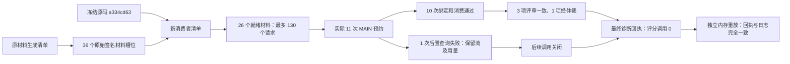

# 真实 TRAIN 评审的产物追溯实例

本轮实际使用 Grok CLI 的 Grok 4.6 订阅入口。11 次 MAIN 预约中，10 次返回
通过绑定及消费核验；第 11 次模型流正常，但调用后的账户查询仅完成 credits，
topup 查询留在已预约状态，整份返回被拒绝。之后未再发出模型请求。
原始程序没有记录底层 HTTP 异常类型，因此不能据此断言超时或具体网络原因。

独立读取器重读请求、原始模型流、账户原件、来源配置和签名材料，再在内存中
重放实际消费者。重建的最终回执及完整日志与原件完全一致；253 个原始文件的
SHA256、大小和 mtime 保持不变。失败返回的 MAIN 用量单独重读核验，缺失的
后置账户观察仍为缺失，不授予它完整绑定或消费资格。

可检查 [157 个节点、260 条来源关系](lineage.json)、
[独立回读记录](independent-readback.json)、[最终诊断回执](diagnostic-result.json)
和 [原始文件清单](manifest.json)。完整请求、回答、账户响应与签名私钥留在
本地私有存储；[私有产物索引](private-artifact-inventory.json)提供非凭据文件的
路径、大小和摘要。下图只概括执行边界，逐产物关系以 JSON 为准。

固定分母仍为四道 TRAIN 题、36 个材料槽位、72 个评分机会和最多 180 次
评审/评分 MAIN 调用。实际材料为 26 就绪、7 缺依据、3 不适用；最终 22 项
评审未完成。实际调用为 reviewer1 5 次、reviewer2 5 次、arbitrator 1 次、
evaluator 0 次。169 是该分配中未使用的 MAIN 额度，不是已完成请求或独立样本。

11 次已知 MAIN 总量为 373740 tokens，其中输出 4434 tokens。原始服务报价
合计为 0.25997760 美元；这不是额外费用结算。额外付费 API 预算为零，标题
用量、全部机会用量和结算仍记为未知。没有模型重试，也没有 VAL 访问。

后来的[只读账户观察](later-account-readonly-observation.json)在同一账户上
完成三个 GET，显示订阅剩余 71%、付费回退关闭。它只证明那次查询时的状态，
不能补入历史失败回执。

实际执行源版本为 `a334cd63fbb61f767b34656bb10844ac0d73e692`，其
[132 项冻结工程检查](../headless-review-adapter-r1/README.md)单独归档。
该诊断没有得到任何真实 evaluator 评分，不证明 benchmark 效果、正式校准或
VAL 验收，也不能推断其他模块的所有输出均已覆盖。
